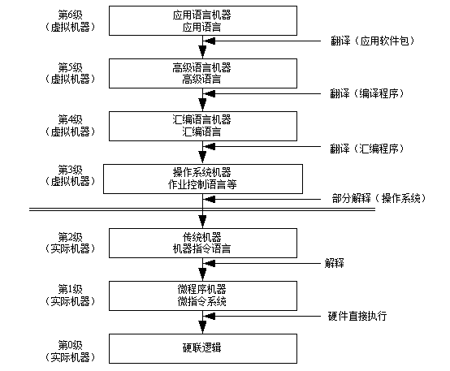
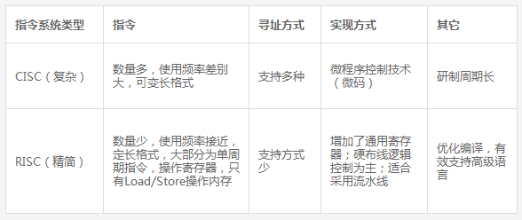

> 对象的三要素为：属性（数据）、方法（操作）、对象ID（标识）。

UML 2.0包括14种图，分别列举如下：
1. 类图（class diagram）。类图描述一组类、接口、协作和它们之间的关系。在OO系统的建模中，最常见的图就是类图。类图给出了系统的静态设计视图，活动类的类图给出了系统的静态进程视图。
2. 对象图（object diagram）。对象图描述一组对象及它们之间的关系。对象图描述了在类图中所建立的事物实例的静态快照。和类图一样，这些图给出系统的静态设计视图或静态进程视图，但它们是从真实案例或原型案例的角度建立的。
3. 构件图（component diagram）。构件图描述一个封装的类和它的接口、端口，以及由内嵌的构件和连接件构成的内部结构。构件图用于表示系统的静态设计实现视图。对于由小的部件构建大的系统来说，构件图是很重要的。构件图是类图的变体。
4. 组合结构图（composite structure diagram）。组合结构图描述结构化类（例如，构件或类）的内部结构，包括结构化类与系统其余部分的交互点。组合结构图用于画出结构化类的内部内容。
5. 用例图（use case diagram）。用例图描述一组用例、参与者及它们之间的关系。用例图给出系统的静态用例视图。这些图在对系统的行为进行组织和建模时是非常重要的。
6. 顺序图（sequence diagram，序列图）。顺序图是一种交互图（interaction diagram），交互图展现了一种交互，它由一组对象或参与者以及它们之间可能发送的消息构成。交互图专注于系统的动态视图。顺序图是强调消息的时间次序的交互图。
7. 通信图（communication diagram）。通信图也是一种交互图，它强调收发消息的对象或参与者的结构组织。顺序图和通信图表达了类似的基本概念，但它们所强调的概念不同，顺序图强调的是时序，通信图强调的是对象之间的组织结构（关系）。在UML 1.X版本中，通信图称为协作图（collaboration diagram）。
8. 定时图（timing diagram，计时图）。定时图也是一种交互图，它强调消息跨越不同对象或参与者的实际时间，而不仅仅只是关心消息的相对顺序。
9. 状态图（state diagram）。状态图描述一个状态机，它由状态、转移、事件和活动组成。状态图给出了对象的动态视图。它对于接口、类或协作的行为建模尤为重要，而且它强调事件导致的对象行为，这非常有助于对反应式系统建模。
10. 活动图（activity diagram）。活动图将进程或其他计算结构展示为计算内部一步步的控制流和数据流。活动图专注于系统的动态视图。它对系统的功能建模和业务流程建模特别重要，并强调对象间的控制流程。
11. 部署图（deployment diagram）。部署图描述对运行时的处理节点及在其中生存的构件的配置。部署图给出了架构的静态部署视图，通常一个节点包含一个或多个部署图。
12. 制品图（artifact diagram）。制品图描述计算机中一个系统的物理结构。制品包括文件、数据库和类似的物理比特集合。制品图通常与部署图一起使用。制品也给出了它们实现的类和构件。
13. 包图（package diagram）。包图描述由模型本身分解而成的组织单元，以及它们之间的依赖关系。
14. 交互概览图（interaction overview diagram）。交互概览图是活动图和顺序图的混合物。

#### UML的结构包括构造块、规则和公共机制三个部分。
1. 构造块。UML有三种基本的构造块，分别是事物（thing）、关系（relationship）和图（diagram）。事物是UML的重要组成部分，关系把事物紧密联系在一起，图是多个相互关联的事物的集合。
2. 公共机制。公共机制是指达到特定目标的公共UML方法，主要包括规格说明（详细说明）、修饰、公共分类（通用划分）和扩展机制四种。规格说明是事物语义的细节描述，它是模型真正的核心；UML为每个事物设置了一个简单的记号，还可以通过修饰来表达更多的信息；UML包括两组公共分类，分别是类与对象（类表示概念，而对象表示具体的实体）、接口与实现（接口用来定义契约，而实现就是具体的内容）；扩展机制包括约束（扩展了UML构造块的语义，允许增加新的规则或修改现有的规则）、构造型（扩展UML的词汇，用于定义新的构造块）和标记值（扩展了UML构造块的特性，允许创建新的特殊信息来扩展事物的规格说明）。
3. 规则。规则是构造块如何放在一起的规定，包括为构造块命名；给一个名字以特定含义的语境，即范围；怎样使用或看见名字，即可见性；事物如何正确、一致地相互联系，即完整性；运行或模拟动态模型的含义是什么，即执行。

#### 计算机系统是一个硬件和软件的综合体，可以把它看作是按功能划分的多级层次结构，如图所示。这种结构的划分，有利于正确理解计算机系统的工作过程，明确软件、硬件在系统中的地位和作用。
s
1. 硬联逻辑级。这是计算机的内核，由门、触发器等逻辑电路组成。
2. 微程序级。这一级的机器语言是微指令集，程序员用微指令编写的微程序一般直接由硬件执行。
3. 传统机器级。这一级的机器语言是该机的指令集，程序员用机器指令编写的程序可以由微程序进行解释。
4. 操作系统级。从操作系统的基本功能来看，一方面它要直接管理传统机器中的软硬件资源，另一方面它又是传统机器的延伸。
5. 汇编语言级。这一级的机器语言是汇编语言，完成汇编语言翻译的程序称为汇编程序。
6. 高级语言级。这一级的机器语言就是各种高级语言，通常用编译程序来完成高级语言翻译的工作。
7. 应用语言级。这一级是为了使计算机满足某种用途而专门设计的，因此，这一级的机器语言就是各种面向问题的应用语言。

#### 指令系统

#### 同一进程间的线程共享的资源包括：
1. 堆：由于堆是在进程空间中开辟出来的，所以它是理所当然地被共享的。
2. 全局变量：它是与具体某一函数无关的，所以也与特定线程无关；因此也是共享的
3. 静态变量：虽然对于局部变量来说，它在代码中是&ldquo;放&rdquo;在某一函数中的，但是其存放位置和全局变量一样，存于堆中开辟的.bss和.data段，是共享的。
4. 文件等公用资源：使用这些公共资源的线程必须同步。Win32 提供了几种同步资源的方式，包括信号、临界区、事件和互斥体。

#### 独享的资源有：
1. 栈：每个线程中的栈都是由线程自身独享的。
2. 寄存器：每个线程执行指令时，都要用到寄存器，线程间的寄存器并不共享。

为了能够更好地分析与设计复杂的大型互连网络，在计算机网络设计中，主要采用分层（分级）设计模型，它类似于软件工程中的结构化设计。在分层设计中，引入了三个关键层的概念，分别是核心层、汇聚层和接入层。
通常将网络中直接面向用户连接或访问网络的部分称为接入层，将位于接入层和核心层之间的部分称为分布层或汇聚层。接入层的目的是允许终端用户连接到网络，因此，接入层交换机具有低成本和高端口密度特性。
汇聚层是核心层和接入层的分界面，完成网络访问策略控制、数据包处理、过滤、寻址，以及其他数据处理的任务。汇聚层交换机是多台接入层交换机的汇聚点，它必须能够处理来自接入层设备的所有通信量，并提供到核心层的上行链路，因此，汇聚层交换机与接入层交换机比较，需要更高的性能，更少的接口和更高的交换速率。
网络主干部分称为核心层，核心层的主要目的在于通过高速转发通信，提供优化、可靠的骨干传输结构，因此，核心层交换机应拥有更高的可靠性，性能和吞吐量。核心层为网络提供了骨干组件或高速交换组件，在纯粹的分层设计中，核心层只完成数据交换的特殊任务。需要根据网络需求的地理距离、信息流量和数据负载的轻重来选择核心层技术，常用的技术包括ATM、100Base-Fx和千兆以太网等。在主干网中，考虑到高可用性的需求，通常会使用双星（树）结构，即采用两台同样的交换机，与汇聚层交换机分别连接，并使用链路聚合技术实现双机互联。