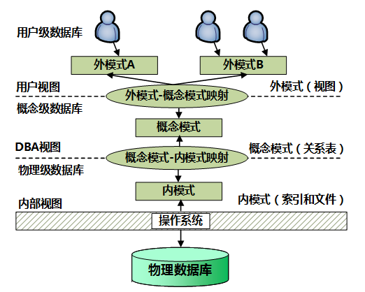
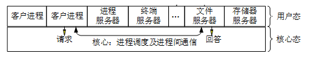

> 对象的三要素为：属性（数据）、方法（操作）、对象ID（标识）。

UML 2.0包括14种图，分别列举如下：
1. 类图（class diagram）。类图描述一组类、接口、协作和它们之间的关系。在OO系统的建模中，最常见的图就是类图。类图给出了系统的静态设计视图，活动类的类图给出了系统的静态进程视图。
2. 对象图（object diagram）。对象图描述一组对象及它们之间的关系。对象图描述了在类图中所建立的事物实例的静态快照。和类图一样，这些图给出系统的静态设计视图或静态进程视图，但它们是从真实案例或原型案例的角度建立的。
3. 构件图（component diagram）。构件图描述一个封装的类和它的接口、端口，以及由内嵌的构件和连接件构成的内部结构。构件图用于表示系统的静态设计实现视图。对于由小的部件构建大的系统来说，构件图是很重要的。构件图是类图的变体。
4. 组合结构图（composite structure diagram）。组合结构图描述结构化类（例如，构件或类）的内部结构，包括结构化类与系统其余部分的交互点。组合结构图用于画出结构化类的内部内容。
5. 用例图（use case diagram）。用例图描述一组用例、参与者及它们之间的关系。用例图给出系统的静态用例视图。这些图在对系统的行为进行组织和建模时是非常重要的。
6. 顺序图（sequence diagram，序列图）。顺序图是一种交互图（interaction diagram），交互图展现了一种交互，它由一组对象或参与者以及它们之间可能发送的消息构成。交互图专注于系统的动态视图。顺序图是强调消息的时间次序的交互图。
7. 通信图（communication diagram）。通信图也是一种交互图，它强调收发消息的对象或参与者的结构组织。顺序图和通信图表达了类似的基本概念，但它们所强调的概念不同，顺序图强调的是时序，通信图强调的是对象之间的组织结构（关系）。在UML 1.X版本中，通信图称为协作图（collaboration diagram）。
8. 定时图（timing diagram，计时图）。定时图也是一种交互图，它强调消息跨越不同对象或参与者的实际时间，而不仅仅只是关心消息的相对顺序。
9. 状态图（state diagram）。状态图描述一个状态机，它由状态、转移、事件和活动组成。状态图给出了对象的动态视图。它对于接口、类或协作的行为建模尤为重要，而且它强调事件导致的对象行为，这非常有助于对反应式系统建模。
10. 活动图（activity diagram）。活动图将进程或其他计算结构展示为计算内部一步步的控制流和数据流。活动图专注于系统的动态视图。它对系统的功能建模和业务流程建模特别重要，并强调对象间的控制流程。
11. 部署图（deployment diagram）。部署图描述对运行时的处理节点及在其中生存的构件的配置。部署图给出了架构的静态部署视图，通常一个节点包含一个或多个部署图。
12. 制品图（artifact diagram）。制品图描述计算机中一个系统的物理结构。制品包括文件、数据库和类似的物理比特集合。制品图通常与部署图一起使用。制品也给出了它们实现的类和构件。
13. 包图（package diagram）。包图描述由模型本身分解而成的组织单元，以及它们之间的依赖关系。
14. 交互概览图（interaction overview diagram）。交互概览图是活动图和顺序图的混合物。

#### UML的结构包括构造块、规则和公共机制三个部分。
1. 构造块。UML有三种基本的构造块，分别是事物（thing）、关系（relationship）和图（diagram）。事物是UML的重要组成部分，关系把事物紧密联系在一起，图是多个相互关联的事物的集合。
2. 公共机制。公共机制是指达到特定目标的公共UML方法，主要包括规格说明（详细说明）、修饰、公共分类（通用划分）和扩展机制四种。规格说明是事物语义的细节描述，它是模型真正的核心；UML为每个事物设置了一个简单的记号，还可以通过修饰来表达更多的信息；UML包括两组公共分类，分别是类与对象（类表示概念，而对象表示具体的实体）、接口与实现（接口用来定义契约，而实现就是具体的内容）；扩展机制包括约束（扩展了UML构造块的语义，允许增加新的规则或修改现有的规则）、构造型（扩展UML的词汇，用于定义新的构造块）和标记值（扩展了UML构造块的特性，允许创建新的特殊信息来扩展事物的规格说明）。
3. 规则。规则是构造块如何放在一起的规定，包括为构造块命名；给一个名字以特定含义的语境，即范围；怎样使用或看见名字，即可见性；事物如何正确、一致地相互联系，即完整性；运行或模拟动态模型的含义是什么，即执行。

#### 计算机系统是一个硬件和软件的综合体，可以把它看作是按功能划分的多级层次结构，如图所示。这种结构的划分，有利于正确理解计算机系统的工作过程，明确软件、硬件在系统中的地位和作用。
s
1. 硬联逻辑级。这是计算机的内核，由门、触发器等逻辑电路组成。
2. 微程序级。这一级的机器语言是微指令集，程序员用微指令编写的微程序一般直接由硬件执行。
3. 传统机器级。这一级的机器语言是该机的指令集，程序员用机器指令编写的程序可以由微程序进行解释。
4. 操作系统级。从操作系统的基本功能来看，一方面它要直接管理传统机器中的软硬件资源，另一方面它又是传统机器的延伸。
5. 汇编语言级。这一级的机器语言是汇编语言，完成汇编语言翻译的程序称为汇编程序。
6. 高级语言级。这一级的机器语言就是各种高级语言，通常用编译程序来完成高级语言翻译的工作。
7. 应用语言级。这一级是为了使计算机满足某种用途而专门设计的，因此，这一级的机器语言就是各种面向问题的应用语言。

#### 指令系统

#### 客户关系管理
客户关系管理（Customer Relationship Management，CRM）将客户看作是企业的一项重要资产，客户关怀是CRM的中心，其目的是与客户建立长期和有效的业务关系，在与客户的每一个“接触点”上都更加接近客户、了解客户，最大限度地增加利润。CRM的核心是客户价值管理，它将客户价值分为既成价值、潜在价值和模型价值，通过“一对一”营销原则，满足不同价值客户的个性化需求，提高客户忠诚度和保有率，实现客户价值持续贡献，从而全面提升企业盈利能力。
供应链管理（Supply Chain Management，SCM）是一种集成的管理思想和方法，它执行供应链中从供应商到最终用户的物流的计划和控制等职能。从单一的企业角度来看，是指企业通过改善上、下游供应链关系，整合和优化供应链中的信息流、物流和资金流，以获得企业的竞争优势。
产品数据管理（Product Data Management，PDM）是一门用来管理所有与产品相关信息（包括零件信息、配置、文档、计算机辅助设计文件、结构、权限信息等）和所有与产品相关过程（包括过程定义和管理）的技术。PDM系统是一种软件框架，利用这个框架可以帮助企业实现对与企业产品相关的数据、开发过程以及使用者进行集成与管理，可以实现对设计、制造和生产过程中需要的大量数据进行跟踪和支持。
通常，可以把知识管理工具分为知识生成工具、知识编码工具和知识转移工具三大类。
（1）知识生成工具。知识的生成包括产生新的想法、发现新的商业模式、发明新的生产流程，以及对原有知识的重新合成。不同方式的知识产生模式有不同的工具对其进行支持。知识生成工具包括知识获取、知识合成和知识创新三大功能。目前，利用具有初步人工智能功能的搜索引擎和知识挖掘工具进行知识的自动获取，可以将相关的词句组合起来，帮助人们将分散的创新观点进行合成。但是，目前实现知识的创新还十分困难，只能利用一些工具实现辅助性的知识创新。
（2）知识编码工具。知识编码是通过标准的形式表现知识，使知识能够方便地被共享和交流。知识编码工具的作用就在于将知识有效地存储并且以简明的方式呈现给使用者，使知识更容易被其他人使用。知识编码的困难在于，知识几乎不能以离散的形式予以表现。知识不断地积累，不断地改变，以至于人们很难对其进行清晰的区分。因此，对知识进行审核和分类是十分困难的。
（3）知识转移工具。知识转移工具最终就是要使知识能在企业内传播和分享。知识的价值在于流动和使用。在知识流动的过程中存在许多障碍，使知识不能毫无阻力地任意流动。这些障碍可分成三类，分别是时间差异、空间差异和社会差异。知识转移工具可以根据各种障碍的特点，在一定程度上帮助人们消除障碍，使知识得到更有效的流动。

#### 商业智能系统
BI系统主要包括数据预处理、建立数据仓库、数据分析和数据展现四个主要阶段。
数据预处理是整合企业原始数据的第一步，它包括数据的抽取（Extraction）、转换（Transformation）和加载（Load）三个过程（ETL过程）；建立数据仓库则是处理海量数据的基础；数据分析是体现系统智能的关键，一般采用OLAP和数据挖掘两大技术。OLAP不仅进行数据汇总/聚集，同时还提供切片、切块、下钻、上卷和旋转等数据分析功能，用户可以方便地对海量数据进行多维分析。数据挖掘的目标则是挖掘数据背后隐藏的知识，通过关联分析、聚类和分类等方法建立分析模型，预测企业未来发展趋势和将要面临的问题；在海量数据和分析手段增多的情况下，数据展现则主要保障系统分析结果的可视化。

#### 业务流程分析
业务流程分析的主要方法有价值链分析法、客户关系分析法、供应链分析法、基于ERP的分析法和业务流程重组等。
（1）价值链分析法。价值链分析法找出或设计出那些能够使顾客满意，实现顾客价值最大化的业务流程。价值链就是一个创造价值的工作流程，在这一总流程基础上，可把企业具体的活动细分为生产指挥流程、计划决策流程、营销流程、信息搜集与控制流程、资金筹措流程等。其中有些业务流程特别重要，对形成企业核心竞争力起着关键作用，这样的业务流程称为基本业务流程，对应于价值链中的基本活动；其他业务流程是对企业的基本经营活动提供支持和服务，称为辅助业务流程，对应于价值链中的辅助活动。
（2）客户关系分析法。客户关系分析法就是把CRM用在业务流程的分析上。CRM的目标是建立真正以客户为导向的组织结构，以最佳的价值定位瞄准最具吸引力的客户，最大化地提高运营效率，建立有效的合作伙伴关系。从CRM的角度分析业务流程，企业的业务流程应当是以客户与企业的关系，以及客户行为为依据的，而不是传统的按照企业内部管理来实施的。
（3）供应链分析法。供应链分析法是从企业供应链的角度分析企业的业务流程，它源于SCM。供应链是指用一个整体的网络用来传送产品和服务，从原材料开始一直到最终客户（消费者），它凭借一个设计好的信息流、物流和资金流来完成。供应链分析法主要从企业内部供应链和外部供应链两个角度来分析企业的业务流程，分析哪些流程处于供应链的核心环节。
（4）基于ERP的分析法。ERP的基本思想是将企业的业务流程看作是一个紧密联接的供应链，将供应商和企业内部的采购、生产、销售，以及客户紧密联系起来，对供应链上的所有环节进行有效管理，实现对企业的动态控制和各种资源的集成和优化，从而提升企业基础管理水平，追求企业资源的合理、高效利用。
（5）业务流程重组。通过重新审视企业的价值链，从功能成本的比较分析中，确定企业在哪些环节具有比较优势。在此基础上，以顾客满意为出发点进行价值链的分解与整合，改造原有的业务流程，实现业务流程的最优化。

#### 系统设计
系统设计的主要内容包括概要设计和详细设计。概要设计又称为系统总体结构设计，它是系统开发过程中很关键的一步，其主要任务是将系统的功能需求分配给软件模块，确定每个模块的功能和调用关系，形成软件的模块结构图，即系统结构图。在概要设计中，将系统开发的总任务分解成许多个基本的、具体的任务，为每个具体任务选择适当的技术手段和处理方法的过程称为详细设计。根据任务的不同，详细设计又可分为多种，例如，网络设计、代码设计、输入/输出设计、处理流程设计、数据存储设计、用户界面设计、安全性和可靠性设计等。

> 人机交互、黄金三原则包括：置于用户控制之下、减少用户的记忆负担、保持界面的一致性。

#### 系统模块结构设计
一个模块应具备以下四个要素：
(1)输入和输出。模块的输入来源和输出去向都是同一个调用者，即一个模块从调用者那儿取得输入，进行加工后再把输出返回调用者。
(2)处理功能。指模块把输入转换成输出所做的工作。
(3)内部数据。指仅供该模块本身引用的数据。
(4)程序代码。指用来实现模块功能的程序。前两个要素是模块的外部特性，即反映了模块的外貌；后两个要素是模块的内部特性。在结构化设计中，主要考虑的是模块的外部特性，其内部特性只做必要了解，具体的实现将在系统实施阶段完成。

#### 系统设计
在系统设计过程中，类可以分为三种类型，分别是实体类、边界类和控制类。
1. 实体类
实体类映射需求中的每个实体，实体类保存需要存储在永久存储体中的信息，例如，在线教育平台系统可以提取出学员类和课程类，它们都属于实体类。实体类通常都是永久性的，它们所具有的属性和关系是长期需要的，有时甚至在系统的整个生存期都需要。
实体类是对用户来说最有意义的类，通常采用业务领域术语命名，一般来说是一个名词，在用例模型向领域模型的转化中，一个参与者一般对应于实体类。通常可以从SRS中的那些与数据库表（需要持久存储）对应的名词着手来找寻实体类。通常情况下，实体类一定有属性，但不一定有操作。
2. 控制类
控制类是用于控制用例工作的类，一般是由动宾结构的短语（“动词+名词”或“名词+动词”）转化来的名词，例如，用例“身份验证”可以对应于一个控制类“身份验证器”，它提供了与身份验证相关的所有操作。控制类用于对一个或几个用例所特有的控制行为进行建模，控制对象（控制类的实例）通常控制其他对象，因此，它们的行为具有协调性。
控制类将用例的特有行为进行封装，控制对象的行为与特定用例的实现密切相关，当系统执行用例的时候，就产生了一个控制对象，控制对象经常在其对应的用例执行完毕后消亡。通常情况下，控制类没有属性，但一定有方法。
3. 边界类
边界类用于封装在用例内、外流动的信息或数据流。边界类位于系统与外界的交接处，包括所有窗体、报表、打印机和扫描仪等硬件的接口，以及与其他系统的接口。要寻找和定义边界类，可以检查用例模型，每个参与者和用例交互至少要有一个边界类，边界类使参与者能与系统交互。边界类是一种用于对系统外部环境与其内部运作之间的交互进行建模的类。常见的边界类有窗口、通信协议、打印机接口、传感器和终端等。实际上，在系统设计时，产生的报表都可以作为边界类来处理。

#### 
信息具有如下基本属性：
真伪性：真实是信息的中心价值，不真实的信息价值可能为负。
层次性：信息一般和管理层一样，可以为战略层、策略层和执行层3个层次。
不完全性：客观事实的全部信息是不可能得到的。我们需要正确滤去不重要的信息、失真的信息，抽象出有用的信息。
滞后性：信息是数据加工的结果，因此信息必然落后于数据，加工需要时间。
扩压性：信息和实物不同，它可以扩散也可以压缩。
分享性：信息可以分享，这和物质不同，并且信息分享具有非零和性。

#### 
SEI 的5级管理能力模式如下：
（1）临时凑合阶段：工作无正式计划，作业进度经常被更改，任务计划、预算、功能、质量都不可预测， 开发机构的整体组织非常混乱。系统的性能、水平依个人能力而定。
（2）简单模仿阶段：开发方开始采用基本的项目管理方法与原理；项目从规划到运行都有明确的计划； 这些计划是通过模仿以前成功的项目开发的例子制定的，有可能通过模仿在本次开发中成功。
（3）完成定义阶段：与项目有关的整体机构的作业进度规格化、标准化，由此达到持续稳定的技术水平 与管理能力。这种工程进度管理能力要求把与开发项目有关的活动、作用和责任充分告知所有的开发者， 并使之充分理解。
（4）管理阶段：这是理想的项目管理阶段。表现在开发者的工程管理能力不断强化，通过可靠的组织与 计划保障，能及早发现可能影响系统功能与性能的缺陷，使系统的性能与可靠性不断改进与提高。
（5）佳化阶段：这一阶段是理想的项目管理阶段。其特点表现在开发者的工程管理能力不断强化，通 过可靠的组织与计划保障，能及早发现项目中可能影响系统功能与性能的缺陷，系统的关键指标在工程的 实施过程中得到全面保证与提高。

#### 
事务服务器包括多个在共享内存中访问数据的进程：
服务器进程：接收用户查询（事务）、执行查询并返回结果的进程。
锁管理器进程：包括锁授予、释放锁和死锁检测。
数据库写进程：有一个或多个进程用来将修改过的缓冲块输出到基于连续方式的磁盘中。
日志写进程：该进程将日志记录从日志记录缓冲区输出到稳定存储器上。
检查点进程：定期执行检查点操作。
进程监控进程：监控其他进程。一旦有进程失败，它将为失败进程执行恢复动作。

#### 关系模式
关系模式R <U，F >来说有以下的推理规则：
A1.自反律（Reflexivity）：若Y⊆X⊆U，则X →Y成立。
A2.增广律（Augmentation）：若Z⊆U且X→Y，则XZ→YZ成立。
A3.传递律（Transitivity）：若X→Y且Y→Z，则X→Z成立。

#### 同一进程间的线程共享的资源包括：
1. 堆：由于堆是在进程空间中开辟出来的，所以它是理所当然地被共享的。
2. 全局变量：它是与具体某一函数无关的，所以也与特定线程无关；因此也是共享的
3. 静态变量：虽然对于局部变量来说，它在代码中是&ldquo;放&rdquo;在某一函数中的，但是其存放位置和全局变量一样，存于堆中开辟的.bss和.data段，是共享的。
4. 文件等公用资源：使用这些公共资源的线程必须同步。Win32 提供了几种同步资源的方式，包括信号、临界区、事件和互斥体。

#### 独享的资源有：
1. 栈：每个线程中的栈都是由线程自身独享的。
2. 寄存器：每个线程执行指令时，都要用到寄存器，线程间的寄存器并不共享。

为了能够更好地分析与设计复杂的大型互连网络，在计算机网络设计中，主要采用分层（分级）设计模型，它类似于软件工程中的结构化设计。在分层设计中，引入了三个关键层的概念，分别是核心层、汇聚层和接入层。
通常将网络中直接面向用户连接或访问网络的部分称为接入层，将位于接入层和核心层之间的部分称为分布层或汇聚层。接入层的目的是允许终端用户连接到网络，因此，接入层交换机具有低成本和高端口密度特性。
汇聚层是核心层和接入层的分界面，完成网络访问策略控制、数据包处理、过滤、寻址，以及其他数据处理的任务。汇聚层交换机是多台接入层交换机的汇聚点，它必须能够处理来自接入层设备的所有通信量，并提供到核心层的上行链路，因此，汇聚层交换机与接入层交换机比较，需要更高的性能，更少的接口和更高的交换速率。
网络主干部分称为核心层，核心层的主要目的在于通过高速转发通信，提供优化、可靠的骨干传输结构，因此，核心层交换机应拥有更高的可靠性，性能和吞吐量。核心层为网络提供了骨干组件或高速交换组件，在纯粹的分层设计中，核心层只完成数据交换的特殊任务。需要根据网络需求的地理距离、信息流量和数据负载的轻重来选择核心层技术，常用的技术包括ATM、100Base-Fx和千兆以太网等。在主干网中，考虑到高可用性的需求，通常会使用双星（树）结构，即采用两台同样的交换机，与汇聚层交换机分别连接，并使用链路聚合技术实现双机互联。